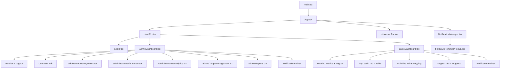

# Frontend Redesign Boundary & Architecture Specification

> **MANDATORY DIRECTIVE FOR FUTURE REDESIGN TOOLS (e.g., Bolt):**  
> **"Future UI redesign work must modify the presentation layer only and must not alter backend logic, APIs, database behavior, authentication, authorization, workflows, or business logic."**

---

## 1. Executive Summary & Purpose

This document establishes the explicit demarcation line between:
1. **PROTECTED CORE LOGIC**: Working backend integrations, Firestore database services, Firebase Authentication, session lifecycle, business rules, revenue/target calculations, activity logging, and real-time synchronization.
2. **REDESIGNABLE PRESENTATION LAYER**: UI components, visual styling, page layouts, CSS theme variables, cards, tables, modal dialogs, navigation shells, and responsive designs.
3. **SHARED / CAREFUL BOUNDARY FILES**: State orchestrators and utility hooks that bridge presentation with business logic.

This specification enables an external AI coding tool (such as Bolt) to execute a complete visual and user experience overhaul without regressing or modifying any underlying system operations.

---

## 2. File & Directory Classification

### 🔴 PROTECTED — DO NOT MODIFY
These files contain core business workflows, API contracts, database operations, security configurations, and data models. **Do NOT modify these files during UI redesign.**

| File / Directory | Responsibility | Critical Protection Reason |
| :--- | :--- | :--- |
| `.env` | Environment configuration & Firebase credentials | Contains live API keys, project IDs, and database URLs. |
| `src/config/firebase.ts` | Firebase App, Auth, Firestore & Messaging init | Core cloud connection; manages fallback logic. |
| `src/services/authService.ts` | Auth lifecycle, session tokens, user lookup | Manages login flows, password bypass logic, and `localStorage` session state (`zoopiter_active_user`). |
| `src/services/leadService.ts` | Lead CRUD & real-time Firestore queries | Handles database collections, audit updates, and snapshot subscriptions. |
| `src/services/targetService.ts`| Target CRUD & periodic assignment | Computes and stores target tracking in Firestore. |
| `src/services/activityService.ts`| Activity logging CRUD & history | Stores calls, meetings, notes, and emails with timestamps. |
| `src/services/userService.ts` | Team member management & Firestore users | Creates Auth credentials and maintains the `users` collection. |
| `src/types/index.ts` | Core TypeScript interfaces (`Lead`, `Target`, `Activity`, `User`) | System-wide data contracts and allowed status literals. |
| `src/types/vite-env.d.ts` | Vite environment type definitions | Global compile-time definitions. |
| `package.json` (root) | Dependency manifests & scripts | Defines exact packages and versions required for application stability. |
| `vite.config.ts` (root) | Vite bundler & path aliases (`@` -> `./src`) | Build target, ports, and module aliases. |

---

### 🟡 SHARED / CAREFUL — MODIFY WITH EXTREME CAUTION
These files sit directly on the boundary between presentation and application logic. They may be touched **only** to alter visual layout, provided that existing function signatures, props, state keys, and event triggers remain strictly intact.

| File / Directory | Presentational Aspect | Business / Core Aspect | Refactoring / Safety Advice |
| :--- | :--- | :--- | :--- |
| `src/App.tsx` | Top-level routing layout (`HashRouter`), page transitions, loading spinner, global toaster container. | Master React state (`currentUser`, `leads`, `targets`, `activities`, `users`), real-time sync hook, CRUD handler definitions. | **Keep handler signatures identical.** Any redesign tool should only alter the wrapping JSX, never the state setters or async functions. |
| `src/hooks/useFirebaseData.ts` | None (pure logic hook). | Manages real-time Firestore listeners (`onSnapshot`) and updates top-level state when user is authenticated. | **Do not touch.** |
| `src/utils/helpers.ts` | Badge color strings (`getStatusColor`, `getPriorityColor`). | Date formatting (`formatDate`) and ISO period calculations (`getCurrentPeriod`). | Visual redesign tools may update the returned CSS classes, but must not alter the calculation logic of periods. |
| `src/components/NotificationManager.tsx` | Dialog popup trigger (`FollowUpReminderPopup`). | Push notification permissions (`getToken`), timer intervals for upcoming follow-ups (5-minute window), overdue detection. | Redesign the popup UI, but **preserve the interval and notification checking logic**. |
| `src/components/NotificationBell.tsx` | Bell icon button, badge count, popover dropdown list. | Filtering logic determining upcoming and overdue follow-ups based on user role (`admin` vs `sales`). | Style the bell and popover, but retain the filter and lead countdown math. |
| `src/components/FollowUpReminderPopup.tsx` | Follow-up alert modal presentation. | Reschedule and completion callbacks passed to `onUpdateLead`. | Can be visually redesigned into a cleaner modal/toast, but all action buttons (`Complete`, `Snooze`, `Dismiss`) must retain their callbacks. |
| `src/routes/index.tsx` | Standby route component (`AppRoutes`). | Role-based PrivateRoute wrapper. | Note: Active routing is currently in `App.tsx`. Do not rewrite unless migrating routing cleanly. |

---

### 🟢 FRONTEND / REDESIGNABLE — TARGET FOR UI/UX REDESIGN
These files contain the visual presentation layer and are the primary targets for UI/UX enhancements, design system implementations, modern layouts, micro-interactions, and themes.

| File / Directory | Scope & Description | Key Presentation Elements |
| :--- | :--- | :--- |
| `src/components/Login.tsx` | Login screen | Split-screen branding banner, login card, input fields, role toggle, 1-click quick-account buttons. |
| `src/components/Login.css` | Login page typography | Font sizes, line heights, responsive text scaling. |
| `src/components/AdminDashboard.tsx` | Admin management console | Header (logo, profile avatar, logout), top overview metric cards, tab navigation (`overview`, `leads`, `team`, `revenue`, `targets`, `reports`), export CSV button, create user modal. |
| `src/components/SalesDashboard.tsx` | Sales representative dashboard | Header (user badge, notifications, logout), target progress cards, tab bar (`leads`, `activities`, `targets`), search/filter bar, lead data table, edit lead dialog, pagination. |
| `src/components/admin/LeadManagement.tsx` | Comprehensive lead operations UI | Search input, filter dropdowns (status, category, assigned sales rep, date ranges), bulk selection toolbar, bulk assignment dialog, lead data table, add lead modal, lead details drawer. *(Note: preserve Excel upload handler)*. |
| `src/components/admin/Reports.tsx` | Business intelligence & reporting screen | Report type selector tabs, date range filters, employee performance tables, activity summaries, Recharts pie/bar charts. |
| `src/components/admin/RevenueAnalytics.tsx` | Revenue & pipeline visualization | Metric cards (total revenue, pipeline value, lost value), target achievement progress bar, Recharts revenue charts (area, bar, line), member breakdown list. |
| `src/components/admin/TargetManagement.tsx` | Target setting & tracking UI | Target progress cards, period filter pills, target achievement table, add/edit target dialogs. |
| `src/components/admin/TeamPerformance.tsx` | Sales team evaluation screen | Team performance metrics, month selector, sales rep performance cards, activity statistics. |
| `src/components/ui/*` (47 components) | Design system component library | Buttons, cards, dialogs, dropdowns, inputs, tables, badges, tabs, popovers, select, sheets, sliders, avatars, tooltips, etc. |
| `src/styles/globals.css` | CSS theme tokens & base variables | Color tokens (`--background`, `--primary`, `--secondary`, `--border`), border radii, typography defaults, dark mode variables. |
| `src/index.css` | Compiled Tailwind utilities & global styles | Root styling rules, font family configurations, reset styles. |
| `src/assets/*` | Visual brand assets | Logos, banners, background images. |
| `index.html` | Application HTML shell | Page title, favicon links, viewport meta tags. |

---

## 3. Frontend Entry Points & Navigation Architecture

### Root Rendering Pipeline
1. **`index.html`**: Mounts `<div id="root"></div>` and loads `/src/main.tsx`.
2. **`src/main.tsx`**: Renders `<App />` inside `React.StrictMode` and imports `./index.css`.
3. **`src/App.tsx`**: The central application controller.
   - Initializes session check (`getActiveUser()`) and background Firebase connection (`ensureFirebaseAuth()`).
   - Hooks into real-time database updates via `useFirebaseData`.
   - Manages top-level routing with `HashRouter` (`#/...`).
   - Renders `<Toaster />` for toast notifications.
   - Conditionally renders `<NotificationManager />` for logged-in sessions.

### Route Mapping
| Route Path | Access Level | Component | Redirect / Protection Rule |
| :--- | :--- | :--- | :--- |
| `#/login` | Public (Unauthenticated) | `<Login onLogin={handleLogin} />` | If user is authenticated, redirects to `#/admindashboard` (if admin) or `#/salesdashboard` (if sales). |
| `#/'` | Root Redirect | `Navigate` | Redirects to `#/login` if unauthenticated, or to the role-specific dashboard. |
| `#/admindashboard` | Protected (`admin` role only) | `<AdminDashboard ... />` | Redirects to `#/login` if no user; redirects to `#/salesdashboard` if role is `sales`. |
| `#/salesdashboard` | Protected (`sales` role only) | `<SalesDashboard ... />` | Redirects to `#/login` if no user; redirects to `#/admindashboard` if role is `admin`. |
| `*` | Catch-all | `Navigate to="/"` | Any unmatched URL redirects to root. |

---

## 4. Component Hierarchy & Layout Structure



---

## 5. Component Contracts (Prop Interfaces)

Future UI redesigns of these components **MUST preserve the incoming and outgoing prop interfaces**:

### A. `Login` Component (`src/components/Login.tsx`)
```typescript
interface LoginProps {
  onLogin: (email: string, password: string, role?: 'admin' | 'sales') => Promise<boolean>;
}
```
*UI redesign requirement:* Any redesign of the login form can change the visual styling, branding, and layouts, but the form submission must invoke `onLogin(email, password, role)`.

### B. `AdminDashboard` Component (`src/components/AdminDashboard.tsx`)
```typescript
interface AdminDashboardProps {
  user: User;
  users: User[];
  leads: Lead[];
  targets: Target[];
  activities: Activity[];
  onLogout: () => void;
  onUpdateLead: (leadId: string, updates: Partial<Lead>) => void;
  onAddLead: (lead: Omit<Lead, 'id'>) => void;
  onDeleteLead: (leadId: string) => void;
  onUpdateTarget: (targetId: string, achieved: number) => void;
  onEditTarget: (targetId: string, updates: Partial<Target>) => void;
  onAddTarget: (target: Omit<Target, 'id' | 'achieved'>) => void;
  onAddUser: (user: Omit<User, 'id'>) => void;
}
```

### C. `SalesDashboard` Component (`src/components/SalesDashboard.tsx`)
```typescript
interface SalesDashboardProps {
  user: User;
  leads: Lead[];
  targets: Target[];
  activities: Activity[];
  onLogout: () => void;
  onUpdateLead: (leadId: string, updates: Partial<Lead>) => void;
  onAddActivity: (activity: Omit<Activity, 'id' | 'timestamp'>) => void;
}
```

### D. `LeadManagement` Component (`src/components/admin/LeadManagement.tsx`)
```typescript
interface LeadManagementProps {
  leads: Lead[];
  salesMembers: User[];
  currentUser?: User;
  onUpdateLead: (leadId: string, updates: Partial<Lead>) => void;
  onAddLead: (lead: Omit<Lead, 'id'>) => void;
  onDeleteLead: (leadId: string) => void;
}
```

---

## 6. Theme & Styling System

The application relies on Tailwind CSS with design tokens defined via CSS custom properties in `src/styles/globals.css` and `src/index.css`.

### Primary Design Tokens
```css
:root {
  --background: #ffffff;
  --foreground: oklch(0.145 0 0);
  --card: #ffffff;
  --card-foreground: oklch(0.145 0 0);
  --primary: #030213;
  --primary-foreground: oklch(1 0 0);
  --secondary: oklch(0.95 0.0058 264.53);
  --secondary-foreground: #030213;
  --muted: #ececf0;
  --muted-foreground: #717182;
  --accent: #e9ebef;
  --accent-foreground: #030213;
  --destructive: #d4183d;
  --destructive-foreground: #ffffff;
  --border: rgba(0, 0, 0, 0.1);
  --radius: 0.625rem;
}
```

### How to Redesign Visually:
- To implement a new color scheme, modify the CSS variable values in `src/styles/globals.css` and `src/index.css`.
- All `src/components/ui/*` components utilize standard Tailwind class combinations (e.g., `bg-primary`, `text-muted-foreground`, `rounded-md`).
- A redesign tool can freely restyle buttons, cards, headers, tables, badges, and modals by updating utility classes or replacing visual elements inside the `🟢 FRONTEND` components.

---

## 7. Rules & Guardrails for Future Redesign Tools (Bolt, etc.)

1. **NO BACKEND OR API REMOVAL**: Never replace `firebaseAddLead`, `firebaseUpdateLead`, `loginUser`, or any functions in `src/services/` with mock static objects.
2. **MAINTAIN PROP CONTRACTS**: Do not remove, rename, or change the parameter types of callbacks passed to screens (`onUpdateLead`, `onAddLead`, `onLogout`, etc.).
3. **PRESERVE STATUS ENUMS**: The `Lead['status']` field accepts exact literals (`'new' | 'quotation_sent' | 'interested' | 'not_able_to_contact' | 'not_interested' | 'won' | 'pending_payment' | 'follow_up' | 'lost' | 'dnp'`). Do not add or rename status strings without updating both backend Firestore queries and TypeScript definitions.
4. **DO NOT BREAK EXCEL / FILE IMPORT**: In `src/components/admin/LeadManagement.tsx`, the Excel import feature parses specific column headers using `xlsx`. If redesigning the upload modal, ensure the file input still connects to the existing parsing function.
5. **KEEP USER ROLE LOGIC INTACT**: Ensure that role checks (`user.role === 'admin'` vs `user.role === 'sales'`) are preserved so data privacy between administrators and sales representatives remains enforced.
6. **PRESERVE FOLLOW-UP WORKFLOWS**: The follow-up notification system alerts reps 5 minutes prior to a scheduled call. Ensure `nextFollowUp` and `followUpStatus` fields remain present in lead forms and detail modals.
7. **DO NOT ALTER .env OR FIREBASE CONFIG**: The application connects to live Firebase Firestore. The configuration in `src/config/firebase.ts` must never be altered or hardcoded.
